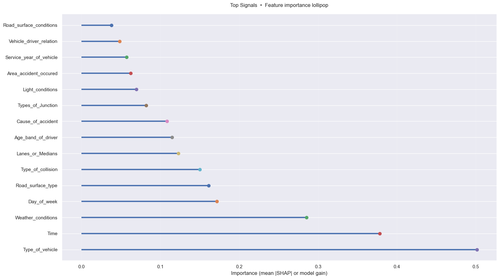

# Accident Severity Prediction (XGBoost + SHAP)

This project predicts road-crash severity (Slight / Serious / Fatal) from roadway, vehicle, and environmental attributes for crashes in Addis Ababa.  
The goal is not just accuracy, but **interpretable risk factors** that can inform road-safety decisions.



---

## Problem & data

- **Task:** Given conditions at the time of a crash, estimate whether the outcome is likely to be Slight, Serious, or Fatal.
- **Data:** Road Traffic Accident dataset from Addis Ababa (~12k crashes).  
- **Target:** `Accident_severity`  
- **Features:** vehicle type, time of day, weather, road surface type/condition, junction type, driver age, cause of accident, etc.

Raw data are **not** stored in this repo; the notebook downloads them programmatically (see notebook for details).

---

## Approach 

1. **Exploratory analysis**
   - Look at class imbalance (Slight >> Serious >> Fatal) and distribution of key variables.
   - Basic checks for duplicates, missing values, and weird category labels.

2. **Cleaning & preprocessing**
   - Standardise categories (e.g. merge “other/unknown” variants).
   - Treat “unknown” style labels as missing and impute:
     - Proportional imputation for categoricals (preserve distributions).
     - Median imputation for numeric fields.
   - Manual ordinal encodings where the order matters (e.g. age bands, light conditions).

3. **Train / test split and imbalance handling**
   - Stratified split so all three severity levels appear in both sets.
   - Random oversampling of minority classes to avoid a “always predict Slight” model.

4. **Modelling**
   - Multi-class **XGBoost** classifier on the processed features.
   - Evaluation with **macro-F1** to treat all three severity levels more fairly.

5. **Explainability**
   - **SHAP** values to see which features push predictions toward Serious/Fatal outcomes.
   - Lollipop / beeswarm style plots used as “hero” visuals for communication.

---

## Repository structure

- `notebook.ipynb` – main analysis: EDA → preprocessing → modelling → SHAP.
- `assets/` – exported figures (hero plots for portfolio / reports).
- `requirements.txt` – Python dependencies.
- `.gitignore`, `LICENSE`, `README.md` – housekeeping.

---

## How to run

```bash
pip install -r requirements.txt
jupyter notebook  # then open the notebook and run all cells
